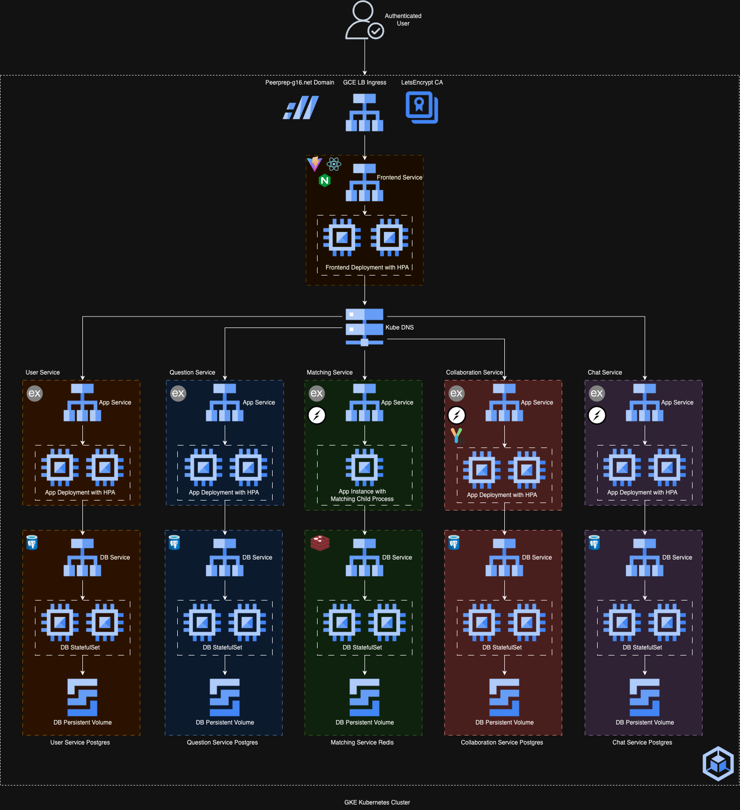

# CS3219 Project (PeerPrep) - AY2425S1

## Group: G16

### Note

- You can choose to develop individual microservices within separate folders within this repository **OR** use individual repositories (all public) for each microservice.
- In the latter scenario, you should enable sub-modules on this GitHub classroom repository to manage the development/deployment **AND** add your mentor to the individual repositories as a collaborator.
- The teaching team should be given access to the repositories as we may require viewing the history of the repository in case of any disputes or disagreements.

## Architecture

We develop the following micro-services:

- [`/backend/user`](./backend/user/README.md): Express service for user accounts, authentication.
- [`/backend/question`](./backend/question/README.md): Express service for question metadata, attempt history.
- [`/backend/matching`](./backend/matching/README.md): Express service for user game matching, via websockets and Redis Streams.
- [`/backend/collaboration`](./backend/collaboration/README.md): Express service for collaborative editing, via YJS and websockets.
- [`/backend/chat`](./backend/chat/README.md): Express service for peer-2-peer chatting.
- [`/frontend`](./frontend/README.md): A UI view layer for the application, built with React Router and Vite, and served with Nginx.

### Hosting/Running

We run this application using Kubernetes, and host this application on Google Kubernetes Service. The documentation can be found [here](./k8s/README.md).

### Docker Compose

Should you desire to rebuild the images, make use of the various commands in our [`Makefile`](./Makefile).

Ideally, you should have Docker running, and you should run the commands in this sequence:

1. `make setup` (Optional)

    - This sets up dependencies and creates the necessary persistent volumes.

2. `make up`

     - In addition to the above,  it also:
         - Runs the migrations/seeding for each service's database within their own Docker container, once running.
         - Builds and starts the services in order.
